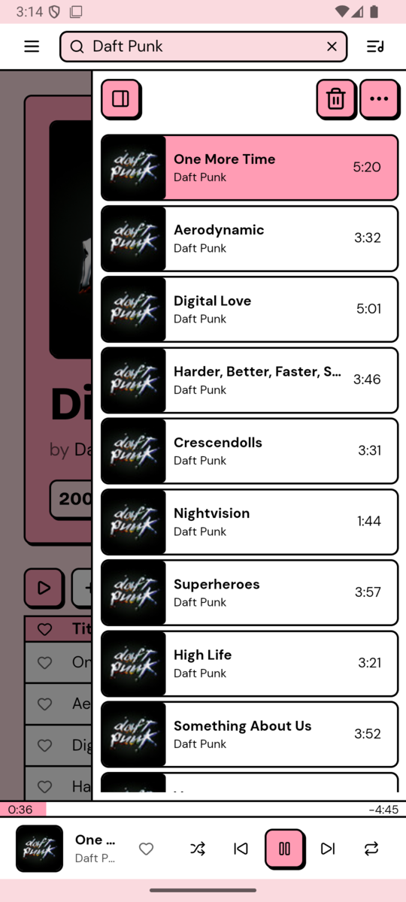
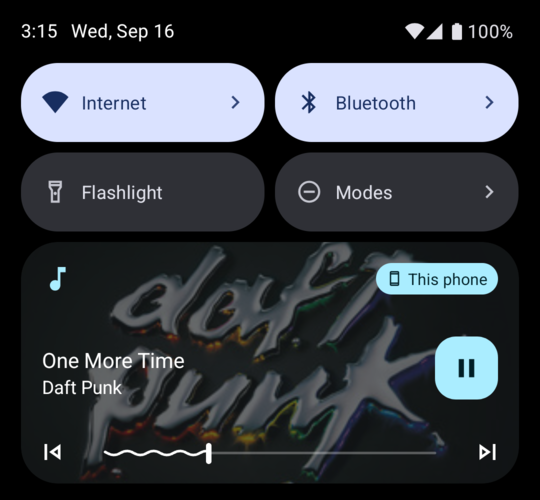
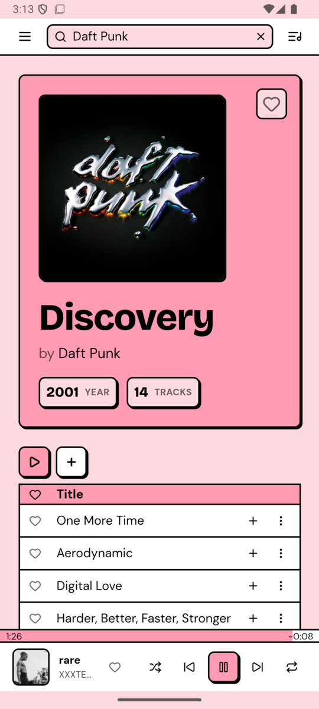
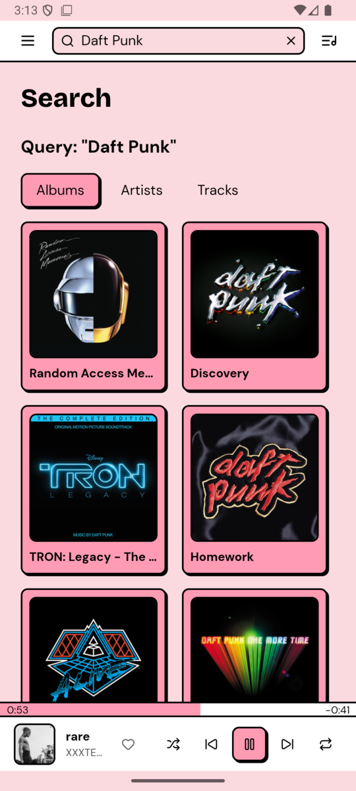
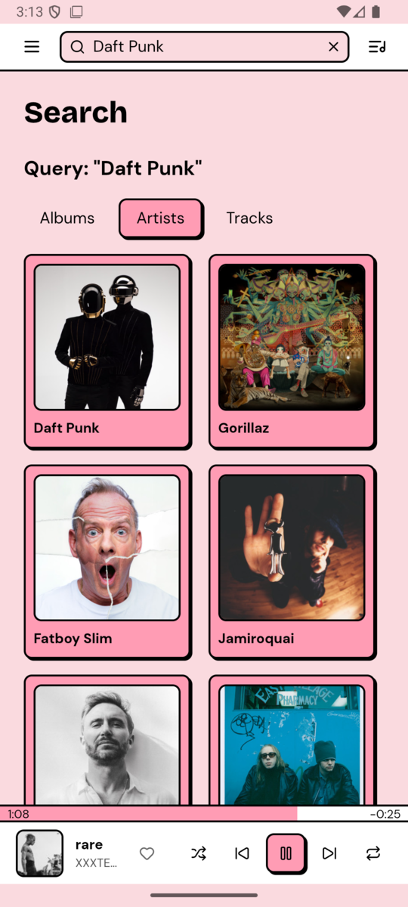
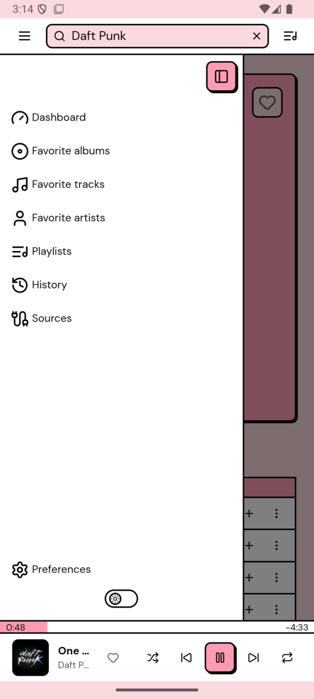
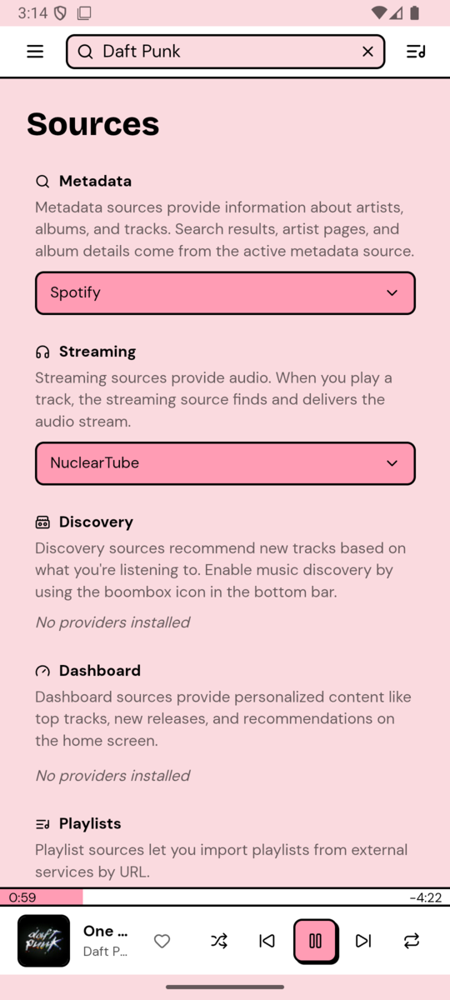
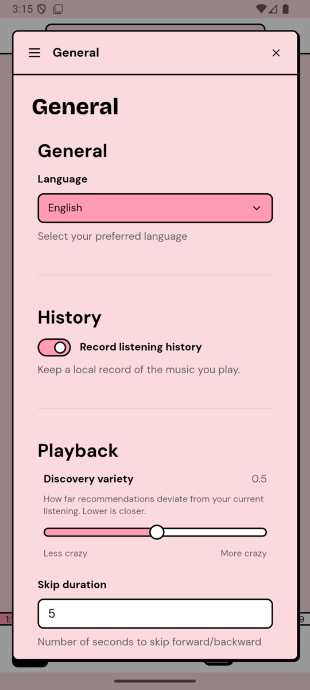
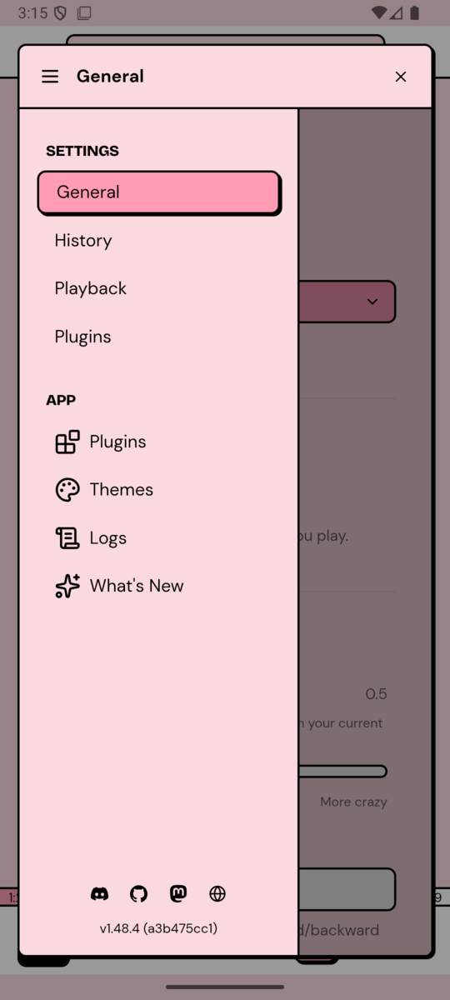

<p align="center">
  
</p>

<div align="center">

# Nuclear for Android

A free, open-source music player without ads or tracking — now in your pocket.<br>
Search any artist, album or song, build a queue, and listen in the background with lock-screen controls.

</div>

> [!NOTE]
> **This is an unofficial fork of [nukeop/nuclear](https://github.com/nukeop/nuclear)** that ports the player to Android. It isn't affiliated with the original project, and it isn't a pull request: upstream doesn't accept code contributions, so this lives here as a separate piece of work.
>
> - 📱 Download the APK: [Releases](../../releases)
> - 📖 Technical write-up of the port: [ANDROID_PORT.md](ANDROID_PORT.md)
> - 🐛 Android bugs go to [this fork's issues](../../issues), not upstream's
> - 🖥️ Looking for Windows, macOS or Linux? Use the [official Nuclear releases](https://github.com/nukeop/nuclear/releases)

## What's different from the original

This isn't just the desktop app squeezed onto a phone. On top of the port itself, a set of backend fixes makes **playback pick the right song more often than the original app does**. The biggest one is in how stream results from plugins are filtered.

### Smarter stream matching

When you play a track, Nuclear asks the streaming plugin for candidates (e.g. YouTube videos) and plays the best one. In the original app that ranking only *reordered* results and never discarded any, so a 9-minute "full EP" upload or a 2-hour documentary could win when it was the top hit. This fork:

- **Rejects candidates that are far too long** for the track, using the real duration when the metadata source provides it.
- **Estimates the duration when it's missing** (common for tracks opened from an album page) from the candidates whose title actually matches, so long compilations can't drag the estimate up.
- **Scales the tolerance with the track, not the candidate**, so a long wrong result can't widen its own margin of error.
- **Recognises more non-song uploads** by title: `full EP`, `complete album`, `documentary` and their Spanish equivalents.

Real case used to validate it: *"rare"* by XXXTENTACION (1:35) used to play a 9:20 full-EP upload. It now plays the 1:35 track, from search and from the album page alike.

### More reliable playback

- **YouTube without yt-dlp.** Android can't run downloaded binaries, so search goes through [rustypipe](https://codeberg.org/ThetaDev/rustypipe) and streams are resolved directly against YouTube's player API.
- **Gentler on YouTube's rate limits.** If Google temporarily blocks requests, the app backs off for a couple of minutes instead of retrying in a loop. Age-restricted videos are no longer mistaken for a block.
- **Faster skips.** The next track is resolved about 15 seconds before the current one ends, so skipping is almost instant.
- **No duplicate requests.** Stale events from the previous track no longer trigger a second, redundant stream lookup.
- **Failed tracks are skipped automatically**, with a limit of 3 in a row so a bad queue doesn't empty itself.
- **The first song in an empty queue starts on its own**, with no extra tap on play.

### Built for a phone

- Background playback with a media notification, lock-screen and headset controls.
- A compact layout under 640px: navigation and queue become drawers, and settings open full-screen.
- Readable track tables on small screens, with the add-to-queue and menu buttons always visible (touch screens have no hover).
- Android back button and system bar insets handled natively.
- A small release APK: **~22 MB**, versus ~650 MB for the first debug builds.
- A boot watchdog that restarts the app automatically if a cold start hangs on a blank screen.

## Screenshots

| | | |
|:---:|:---:|:---:|
|  |  |  |
| Playing, with the queue open | Background playback controls | Album page |
|  |  |  |
| Album search | Artist search | Navigation drawer |
|  |  |  |
| Recommended sources | Settings | Settings sections |

## Recommended setup

Nuclear doesn't come with music sources built in; everything comes from plugins. A fresh install shows an empty dashboard until you add some. This combination is the one tested most on Android:

| Role | Plugin | Why |
|---|---|---|
| **Metadata** | **Spotify** | Accurate artist, album and track data, including track durations, which the stream filter uses to pick the right upload. |
| **Streaming** | **NuclearTube** | YouTube audio without yt-dlp, using the Android-compatible backend in this fork. |

1. Open the menu **☰ → Preferences → Plugins → Store**.
2. Install **Spotify** and **NuclearTube**.
3. Go to **☰ → Sources** and set **Metadata = Spotify** and **Streaming = NuclearTube**.
4. Search for something and press play.

Other streaming plugins (Bandcamp, SoundCloud, KHInsider) have also been tested and work. The `youtube-playlists` plugin **does not** work on Android (see [Known limitations](#known-limitations)).

## Compatibility

These are theoretical requirements taken from the APK's manifest and build configuration. The build has been tested on an Android 16 emulator and a physical Android 13 phone.

| | |
|---|---|
| **Minimum Android version** | Android 7.0 Nougat (API 24) |
| **Target Android version** | Android 16 (API 36) |
| **CPU architecture** | `arm64-v8a` only (64-bit ARM) |
| **Not supported** | 32-bit ARM (`armeabi-v7a`), x86 / x86_64 devices |
| **WebView** | An up-to-date Android System WebView / Chrome (the UI and audio engine run inside it) |
| **Permissions** | Internet and notifications (for the playback controls) |

In practice, **almost any Android phone sold since 2017 should run it**, since they are 64-bit ARM. Very old or budget 32-bit devices, Intel-based tablets and most Chromebooks won't install it. Android TV and tablets can install it but don't have a dedicated layout.

> [!TIP]
> On Android 7–9, update **Android System WebView** from the Play Store before installing. An outdated WebView is the most likely cause of problems on older devices.

### Installing

1. Download the `.apk` from [Releases](../../releases).
2. Open it and allow installing from this source when Android asks.
3. On first launch, grant the notification permission so the playback controls appear.

The APK is signed with a development key, not a store key. If a future release changes the signature, you'll need to uninstall the old version first, and that erases the app's data.

## Known limitations

- **Cold starts can hang for a few seconds.** It's a race in Tauri's Android IPC. The boot watchdog restarts the app automatically, and it usually reaches the UI on the first or second try.
- **YouTube playlists can't be imported** on Android (`youtube-playlists` plugin), because rustypipe's playlist support doesn't work yet.
- **Google may still throttle YouTube** after many skips in a short time. It clears on its own after a few minutes.
- **Stream matching only sees the plugin's top results.** If the right song isn't among them, the filter can't invent it.
- Desktop-only features are compiled out on Android: MCP server, MPD server, local HTTP API, Discord Rich Presence and auto-updates.

## Building from source

Nuclear is a pnpm + Turborepo monorepo. The app is Tauri v2 (Rust + React).

**Requirements:** Node.js 24, pnpm, stable Rust, and for Android the Android SDK + NDK with the Rust targets (`rustup target add aarch64-linux-android x86_64-linux-android`). See the [Tauri prerequisites](https://v2.tauri.app/start/prerequisites/).

```bash
git clone https://github.com/eloyalo/nuclear.git
cd nuclear
pnpm install

# Desktop
pnpm dev

# Android release APK for real phones (arm64)
export BINDGEN_EXTRA_CLANG_ARGS_aarch64_linux_android="--sysroot=$NDK_HOME/toolchains/llvm/prebuilt/linux-x86_64/sysroot --target=aarch64-linux-android24"
pnpm --filter @nuclearplayer/player tauri android build --apk --target aarch64

# Android debug build for the x86_64 emulator
pnpm --filter @nuclearplayer/player tauri android build --debug --apk --target x86_64
```

The `BINDGEN_EXTRA_CLANG_ARGS_*` variable is needed so that `rquickjs-sys` (pulled in by rustypipe) generates bindings against the NDK sysroot instead of your host's headers. Without it the build fails with `__float128 is not supported on this target`. For the x86_64 target, use the same variable with `x86_64` in its name and `--target=x86_64-linux-android24`.

The release APK is written unsigned to `packages/player/src-tauri/gen/android/app/build/outputs/apk/universal/release/`. Sign it with `zipalign` + `apksigner` before installing.

```bash
pnpm test           # Run all tests
pnpm lint           # Lint all packages
pnpm type-check     # TypeScript checks
```

## Credits

All the credit for Nuclear itself goes to [nukeop](https://github.com/nukeop) and the [Nuclear contributors](https://github.com/nukeop/nuclear/graphs/contributors). This fork only adds the Android port and the fixes described above. Plugins belong to their respective authors.

Upstream community: [Discord](https://discord.gg/JqPjKxE) · [Mastodon](https://fosstodon.org/@nuclearplayer) · [Discussions](https://github.com/nukeop/nuclear/discussions)

## License

AGPL-3.0, same as the original project. See [LICENSE](LICENSE).
